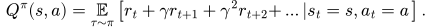

This blog post is meant to be a practical introduction to (deep) reinforcement learning[^value-based], presenting the main concepts and providing intuitions to understand the more recent Deep RL algorithms.
For a more in-depth and theoretical introduction, I recommend reading the [RL Bible](http://incompleteideas.net/book/the-book-2nd.html) by Sutton and Barto.

The plan for this post is to start from tabular Q-learning and work our way up to Deep Q-learning (DQN). 
In a [following post (RL103)](../rl103), I continue on to the Soft Actor-Critic (SAC) algorithm and its extensions.

The associated code and notebooks for this tutorial can be found on GitHub: https://github.com/araffin/rlss23-dqn-tutorial

Note: this post is a written version of the [tutorial](https://araffin.github.io/talk/rlss-23/) I gave at the [RL Summer School 2023](https://rlsummerschool.com/). It is also part of my PhD Thesis (to be published).

Note: I assume you are familiar with basic RL concepts, if not please have a look at this [RL 101](https://spinningup.openai.com/en/latest/spinningup/rl_intro.html) tutorial.
I provide a very short formal introduction to the RL terminology used in this post at the end of it.

## Tabular RL: A Discrete World

In tabular RL, states and actions are discrete, so in this setting it is possible to represent the world as a large table.
Each entry corresponds to a state and can be subdivided by the number of possible actions in that state.


<p style="font-size: 14pt; text-align:center;">
Illustration of a $Q$-Table representing the expected outcomes of actions for each state.
</p>

## Action-Value Function ($Q$-function)

One key element to solve the discounted [RL problem](https://spinningup.openai.com/en/latest/spinningup/rl_intro.html) is the action-value function, or $Q$-function, noted $Q^{\pi}$ for a given policy $\pi$.
It is defined as the expected discounted return starting in state $s$, taking action $a$, and following policy $\pi$:

<!--Q^{\pi}(s, a) = \mathop{\mathbb{E}}_{\tau \sim \pi}\left[{r_t + \gamma r_{t+1} + \gamma^2 r_{t+2} + \ldots \left| s_t = s, a_t = a\right.}\right].-->


In other words, the $Q$-function gives an estimate of *how good it is to take the action $a$ in state $s$ while following a policy $\pi(s)$*.

The $Q$-function can be estimated recursively, also known as the Bellman equation:

<!--Q^{\pi}(s, a) = \mathop{\mathbb{E}}_{s'\sim P}\left[ r(s,a) + \gamma \mathop{\mathbb{E}}_{a'\sim \pi}\left[ Q^{\pi}(s',a') \right] \right].-->


This rewrite allows to build an estimate of the $Q$-value without having to wait for terminal states.
It is the formula used in practice.

By definition of the optimal policy, which selects the actions that **max**imize the <span style="color: #5F3DC4">expected return</span>, the following optimal $Q$-function Bellman equation is obtained:

<!--Q^{\ast}(s,a) = \mathop{\mathbb{E}}_{s'\sim P}\left[ r(s,a) + \gamma \boldsymbol{\max_{a'}} \color{#5F3DC4}{Q^{\ast}(s',a')} \right].-->


The other way around, if we have the optimal action-value function $Q^\ast$, we can retrieve the action taken by the optimal policy $\pi^*$ using:

\begin{align}
  \pi^*(s) = \mathop{\text{argmax}}_{a \in A}{\ Q^{\ast}(s, a)}.
\end{align}

<!--(not optimal most of the time)-->
Similarly, we can derive a greedy policy from the $Q$-function associated with policy $\pi$:

\begin{align}
  \pi(s) = \mathop{\text{argmax}}_{a \in A}\ Q^\pi(s, a).
\end{align}

This policy is implicitly defined: we take the action that maximizes the $Q$-function.
In the tabular case, this action is found by enumerating all possible actions.

For the rest of this blog post, I will drop the $\pi$ superscript from $Q^{\pi}$ so as not to overload the notation (more indices are coming), but unless otherwise noted, $Q$ will always be $Q^{\pi}$.

## $Q$-Learning

For discrete states and actions, the [$Q$-learning algorithm](https://en.wikipedia.org/wiki/Q-learning) can be used to estimate the $Q$-function of a policy, in this particular case represented as a lookup table ($Q$-table, shown [above](#tabular-rl-a-discrete-world)).

### An iterative algorithm

The idea is to start with an initial estimate for the first iteration ($n = 0$)[^initial-estimate] and slowly update the estimate over time according to the [Bellman equations](#bellman-eq).
For each transition tuple $(s_t, a_t, r_t, s_{t+1})$, we compute the error between the <span style="color: #1864AB">estimation</span>  and the <span style="color: #A61E4D">target</span> value and update the estimate with a learning rate $\eta$:

<!--$$
  Q^n(s_t, a_t) = Q^{n-1}(s_t, a_t) + \eta \cdot \bigl(\color{#A61E4D}{r_t + \gamma \cdot \max_{a'} Q^{n-1}(s_{t+1}, a')} - \color{#1864AB}{Q^{n-1}(s_t, a_t)}\bigr).
$$-->


Under the assumptions that all state-action pairs are visited an infinite number of times and that we use a learning rate $\eta \in ]0,1[$, the $Q$-learning algorithm converges to a fixed point (i.e., $Q^{n+1}(s, a) = Q^n(s, a)$): the optimal action-value function $Q^*(s, a)$.

<!--
<p style="font-size: 14pt; text-align:center;">
Illustration of a $Q$-function approximated by a lookup table (tabular case)
</p>

<p style="font-size: 14pt; text-align:center;">
Illustration of a $Q$-function approximated using regression (FQI)
</p>-->

### Limitations of $Q$-learning

The main limitation of $Q$-learning and its $Q$-table is that it can only handle discrete states.
The size of the table grows with the number of states, which becomes intractable when this number is infinite (continuous states).


<p style="font-size: 14pt; text-align:center;">
Illustration of a $Q$-function approximated by a lookup table (tabular case).
</p>

Moreover, it does not provide any generalization (as shown in the picture above): knowing the $Q$-values for some states does not help to predict the $Q$-values of unseen states.

## Function Approximation and Fitted Q-Iteration (FQI)

A straightforward extension to $Q$-learning is to estimate the $Q$-function using function approximation instead of a $Q$-table, as displayed in the figure below:


<p style="font-size: 14pt; text-align:center;">
Illustration of a $Q$-Table (left) and Fitted Q-Iteration (FQI) value estimator (right).
Compared to the $Q$-Table, which is limited to discrete states, the FQI value estimator approximates the $Q$-value for continuous state spaces.
</p>

### A Regression Problem

In other words, the $Q$-value estimation problem can be formulated as a regression problem ($\color{#1864AB}{f_{\textcolor{black}{\theta}}(X)} = \color{#A61E4D}{Y}$):

<!--\begin{align}
\color[rgb]{0.09,0.39,0.67}{Q^n_{\theta}(s_t, a_t)} &= 
\color[rgb]{0.65,0.12,0.30}{r_t + \gamma \cdot \max_{a' \in \mathcal{A}}(Q^{n-1}_{\theta}(s_{t+1}, a'))} \\
\mathcal{L}(\theta, X, Y) &= 
\frac{1}{2} \bigl(\color[rgb]{0.65,0.12,0.30}{Y} - \color[rgb]{0.09,0.39,0.67}{f_{\theta}(X)}\bigr)^2
\end{align}-->


where $\color{#1864AB}{X = (s_t, a_t)}$ is the input, $\color{#A61E4D}{Y = r_t + \gamma \cdot \max_{a' \in \mathcal{A}} \ldots }$ is the target, $\theta$ are the parameters to be optimized[^regression], and $\mathcal{L}$ is the loss function.

This is similar to what the $Q$-learning algorithm does.

<div class="d-flex align-items-baseline">


</div>
<p style="font-size: 14pt; text-align:center;">
Illustration of a $Q$-function approximated by a lookup table (left, tabular case) and using regression (right, FQI)
</p>


Since the target $\color{#A61E4D}{Y}$ used to update $Q_{\theta}$ depends on $Q_{\theta}$ itself, we need to iterate.

Computing an iterative approximation of the $Q$-function using regression is the main idea behind the [Fitted Q-Iteration](https://www.jmlr.org/papers/volume6/ernst05a/ernst05a.pdf) algorithm (FQI), presented below.
This algorithm uses a fixed dataset $\mathcal{D}$ of $m$ transitions $(s_t, a_t, r_t, s_{t+1})$.


In Python code, this is how the FQI algorithm looks like:
```python
initial_targets = rewards
# Initial Q-value estimate
qf_input = np.concatenate((states, actions))
# qf_model can be any sklearn regression model
# for instance: qf_model = LinearRegression()
qf_model.fit(qf_input, initial_targets)
 
for _ in range(N_ITERATIONS):
    # Re-use Q-value model from previous iteration
    # to create the next targets
    next_q_values = get_max_q_values(qf_model, next_states)
    # Non-terminal states target
    targets[non_terminal_states] = rewards + gamma * next_q_values
    # Special case for terminal states
    targets[terminal_states] = rewards
    # Update Q-value estimate
    qf_model.fit(qf_input, targets)
```

### Limitations of FQI


FQI is a step toward a more practical algorithm, but it still has some limitations:
1. It requires a dataset of transitions $\mathcal{D}$ and does not provide an explicit way to collect new transitions
2. A loop over actions is needed to obtain $\max_{a' \in \mathcal{A}}Q^{n-1}_\theta(\ldots)$, which is inefficient
3. Because $Q_\theta^{n}$ depends on $Q_\theta^{n-1}$, this leads to instability (the regression target is constantly moving)

## Deep Q-Learning (DQN) - Extending FQI

The [Deep Q-Learning](https://arxiv.org/abs/1312.5602) (DQN) algorithm introduces several components to overcome the limitations of FQI.

### Experience Replay

First, instead of having a fixed dataset of transitions, DQN uses [experience replay](https://apps.dtic.mil/sti/tr/pdf/ADA261434.pdf), also called a replay buffer.

The replay buffer, shown below, is a first in first out (FIFO) data structure of capacity $m$, the maximum number of transitions that can be stored.
When the buffer is full, old experience is removed.

Experience replay provides a compromise between online learning, where transitions are discarded after use, and offline learning, where transitions are stored forever.


<p style="font-size: 14pt; text-align:center;">
DQN replay buffer.
</p>

To train its $Q$-network, DQN creates mini-batches[^batch] of experience by sampling uniformly from the replay buffer, as illustrated below.

This breaks the correlation between consecutive samples, allows the agent to learn from diverse experiences (not just the most recent ones), and allows more efficient use of data by reusing past transitions multiple times.


<p style="font-size: 14pt; text-align:center;">
DQN replay buffer sampling.
</p>

### $\epsilon$-greedy Exploration


DQN collects samples using an $\epsilon$-greedy strategy: at each step, it chooses a random action with a probability $\epsilon$, or otherwise follows the greedy policy (take the action with the highest $Q$-value in that state).

To balance exploration and exploitation, DQN starts with $\epsilon_\text{initial} = 1$ (random policy) and linearly decreases its value until it reaches its final value, usually $\epsilon_\text{final} = 0.01$.

### $Q$-Network and Target $Q$-network


Like [Neural FQI](https://link.springer.com/chapter/10.1007/11564096_32) (NFQ), DQN uses a neural network to approximate the $Q$-function.
However, to avoid the loop over actions of FQI, it outputs all the $Q$-values for a given state.

Finally, to stabilize learning, DQN uses an old copy of the $Q$-network $Q_{\theta_\text{targ}}$ to compute the regression target.
This second network, the target network, is updated every $k$ steps, so that it slowly follows the online $Q$-network.

### The Full DQN Algorithm


<p style="font-size: 14pt; text-align:center;">
  Deep Q-Network (DQN) and its main components.
</p>

<p style="font-size: 14pt; text-align:center;">
  Annotated DQN algorithm from the <a href="https://arxiv.org/abs/1312.5602">DQN paper</a>.
</p>

Overall, the DQN algorithm is very similar to the FQI algorithm, the main difference being that DQN alternates between collecting new transitions and updating its network.


## Beyond DQN: Algorithms for Continuous Action Spaces (DDPG, TD3, SAC, ...)

In this post, I started from the tabular case, where you can use the $Q$-learning algorithm to estimate the $Q$-value function, represented as a table.

To extend the idea of $Q$-learning to continuous states, FQI replaces the $Q$-table with function approximation.
It then refines its estimate iteratively, solving a regression problem at each step.

Finally, DQN introduces several components to overcome the limitations of FQI.
Notably it uses a neural network for faster inference and a replay buffer to re-use past data.

The key components of DQN ($Q$-network, target network, replay buffer) are at the core of Deep RL algorithms for continuous control used on real robots, such as Soft Actor-Critic (SAC).
I introduce these algorithms in the [next blog post (RL103)](../rl103).

## Appendix: RL101

Here is a very short formal introduction to the RL terminology used in this post.

In reinforcement learning, an agent interacts with its environment, usually modeled as a Markov Decision Process[^markov] (MDP) $(\mathcal{S}, \mathcal{A}, P, r)$ where $\mathcal{S}$ is the state space, $\mathcal{A}$ the action space and $P(\mathbf{s}' \mid \mathbf{s}, \mathbf{a})$ the transition function.
At every step $t$, the agent performs an action $\mathbf{a}$ in state $\mathbf{s}$ following its policy $\pi : \mathcal{S} \mapsto \mathcal{A}$.
It then receives a feedback signal in the next state $\mathbf{s}'$: the reward $r(\mathbf{s}, \mathbf{a})$. The objective of the agent is to maximize the long-term reward.
More formally, the goal is to maximize the expectation of the sum of discounted reward, over the trajectories $\rho_\pi$ generated using its policy $\pi$:

<!--J = \sum_t \mathbb{E}_{(\mathbf{s}_t,\mathbf{a}_t)\sim\rho_\pi}\left[ \gamma^t \, r(\mathbf{s}_t,\mathbf{a}_t) \right]-->


where $\gamma \in [0,1)$ is the discount factor and represents a trade-off between maximizing short-term and long-term rewards.
The agent-environment interactions are often broken down into sequences called *episodes*, that end when the agent reaches a terminal state.

In the example of learning to walk, if the goal is to achieve the fastest speed, an immediate reward can be the distance traveled between two timesteps.
The state would be the current information about the robot (joint positions, velocities, torques, linear acceleration, ...) and the action would be a desired motor position.

## Appendix: DQN Code

Similar to FQI, the [DQN update](https://github.com/DLR-RM/stable-baselines3/blob/c6ce50fc7020eb8c009d9579e0c0dbbdba024bc0/stable_baselines3/dqn/dqn.py#L187) looks like that:

```python
# Sample replay buffer
replay_data = replay_buffer.sample(batch_size)

with th.no_grad():
    # Compute the next Q-values using the target network
    next_q_values = q_net_target(replay_data.next_observations)
    # Follow greedy policy: use the one with the highest value
    next_q_values, _ = next_q_values.max(dim=1)
    # 1-step TD target (handle both terminated and not terminated states in one line)
    target_q_values = replay_data.rewards + (1 - replay_data.terminated) * gamma * next_q_values

# Get current Q-values estimates
current_q_values = q_net(replay_data.observations)
# Retrieve the q-values for the actions from the replay buffer
current_q_values = th.gather(current_q_values, dim=1, index=replay_data.actions.long())

# Compute loss
loss = F.mse_loss(current_q_values, target_q_values)
# Optimize the policy
policy.optimizer.zero_grad()
loss.backward()
policy.optimizer.step()
```


## Citation

```
@article{raffin2025rl102,
  title   = "RL102: From Tabular Q-Learning to Deep Q-Learning (DQN)",
  author  = "Raffin, Antonin",
  journal = "araffin.github.io",
  year    = "2025",
  month   = "Sept",
  url     = "https://araffin.github.io/post/rl102/"
}
```

## Acknowledgement

I would like to thank Anssi and Alison for their feedback =).

All the graphics were made using [excalidraw](https://excalidraw.com/).


### Did you find this post helpful? Consider sharing it 🙌

## Footnotes

[^value-based]: I will focus for now on value-based methods.
[^initial-estimate]: The initial estimate is usually zero.
[^regression]: To ease the transition to DQN, we consider only parametric estimators here (i.e., we exclude kNN [for instance](https://en.wikipedia.org/wiki/Nonparametric_regression))
[^batch]: Rather than doing updates using the entire dataset, it is more practical to perform gradient updates with subsets sampled from the dataset.
[^markov]: The Markov property states that next state and reward depend only on the current state and action, not on the history of previous states and actions.
