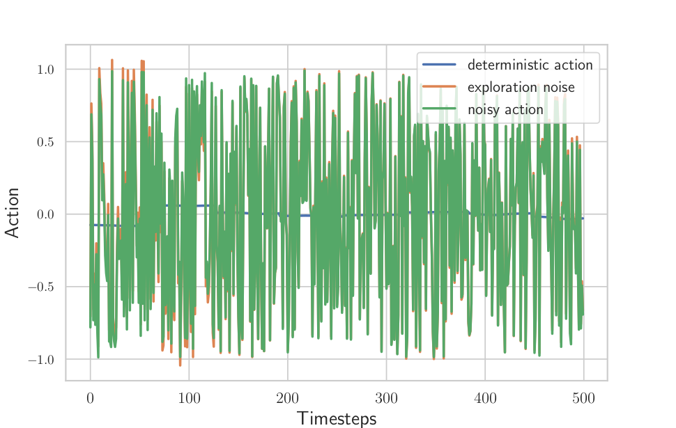

In this post, we will revisit a paper from OpenAI research named [*Parameter Space Exploration for Reinforcement Learning*](https://arxiv.org/abs/1706.01905) [^1] and investigate the claims from that paper.\
Although most of the claims hold, we found that the role of one critical parameter, the noise sampling interval, mentioned only in the appendix was completely overlooked [^noisy-net].
We provide code to reproduce the experiments.

[^noisy-net]: In fact, this parameter was also overlooked in a similar work named [Noisy Network for Exploration](https://arxiv.org/abs/1706.10295) aka Noisy DQN

## Introduction

While working the paper [Smooth Exploration for Robotic Reinforcement Learning]() (aka gSDE, accepted at CoRL21 =)), I ran several ablation studies and had to compare the method I was working on to different baselines. One of them was *Parameter Space Exploration for Reinforcement Learning* by Plappert et al. (we will refer to it as *Param Exploration paper* for brievety) which proposes an alternative to exploration in action space.

The ablation study on my method (gSDE) revealed the importance of an hyperparameter, that was only briefly mentioned in the appendix of the other paper.
I therefore decided to investigate more closely the role of that hyperparameter for the parameter space exploration method.\
This blog post is the summary of my findings.

Note: the finding should be similar for noisy net DQN (+ also only mentioned in the appendix (screenshot))

[^1]: Plappert, Matthias, et al. "Parameter space noise for exploration." ICLR (2017).

## Exploration in Action or Parameter Space

Before we dive into the Param Exploration paper, let's do a quick recap of how exploration can be done in Reinforcement Learning (RL) with continuous actions.
It is usually done in action space but can be done in parameters space or alternatively using a third solution named State-Dependent Exploration.

### Exploration in Action Space

As mentioned previously, in RL with continuous actions, the exploration is commonly done in the *action space*.
At each time-step, a noise vector $\epsilon_t$ is independently sampled from a Gaussian distribution and then added to the controller output:

$$
  \mathbf{a}_t = \mu(\mathbf{s}_t; \theta) + \epsilon_t, \quad \quad \epsilon_t \sim \mathcal{N}(0, \sigma^2)
$$

where $\mu(\mathbf{s}_t)$ is the deterministic policy and $\pi(\mathbf{a}_t | \mathbf{s}_t) \sim \mathcal{N}(\mu(\mathbf{s}_t), \sigma^2)$ is the resulting stochastic policy, used for exploration. $\theta$ denotes the parameters of the deterministic policy.

This is simple to implement, effective in simulation but its output is very noise and should not be used on real robots:

*Exploration in action space: it leads to high frequency noise*

### Exploration in Parameter Space

Alternatively, the exploration can also be done in the *parameter space*

$$
  \mathbf{a}_t = \mu(\mathbf{s}_t; \theta + \epsilon), \quad \quad \epsilon \sim \mathcal{N}(0, \sigma^2)
$$

at the beginning of an episode, the perturbation $\epsilon$ is sampled and added to the policy parameters $\theta$.
This usually results in more consistent exploration but becomes challenging with an increasing number of parameters[^1].
That's what the Parameter Space Exploration paper tried to tackle.
We will see how in the next section, but before let's finish the tour with the last type of exploration.

### State-Dependent Exploration (SDE)

*State-Dependent Exploration (SDE)* [^2] is an intermediate solution that consists in adding noise as a function of the state $\mathbf{s}_t$, to the deterministic action $\mu(\mathbf{s}_t)$.
At the beginning of an episode, the parameters $\zeta$ of that exploration function are drawn from a Gaussian distribution. The resulting action $\\mathbf{a}_t$ is as follows:
$$
  \mathbf{a}_t = \mu(\mathbf{s}_t; \theta) + \epsilon(\mathbf{s}_t; \zeta), \quad \quad \zeta \sim \mathcal{N}(0, \sigma^2)
$$
This episode-based exploration is smoother and more consistent than the unstructured step-based exploration. Thus, during one episode, instead of oscillating around a mean value, the action $\mathbf{a}$ for a given state $\mathbf{s}$ will be the same.

[^2]: Rückstiess, Thomas, et al. "Exploring parameter space in reinforcement learning." Paladyn 1.1 (2010): 14-24.

### Generalized State-Dependent Exploration (gSDE)

Generalized state-dependent exploration (gSDE) [^gSDE] builds on SDE but improve it by:
- sampling the noise parameters $\zeta$ every $n$ steps to improve exploration
- using policy features as input in order to be independent from the state size

[^gSDE]: Raffin, Antonin, et al. "Smooth Exploration for Robotic Reinforcement Learning" CoRL 2021

Now that we have an overview of how exploration can be done in RL, let's dive into the details of the Parameter Exploration paper.

## Parameter Space Exploration for Reinforcement Learning

Published in 2017 by OpenAI, this paper tries to address the difficulty of exploring in parameter space when the number of parameter is high, which is the case when we use neural networks.

To tackle that issue, it proposes two improvements over classic parameter space exploration:

1. Add layer normalization at each layer, so the perturbation can ...
2. Adapt the noise magnitude over time by defining a distance in the action space

One last hyperparameter mentioned in the appendix only: noise sampling interval.
Intuitively, if the noise does not change during one episode, which is problematic if the episode length is long, because the exploration will be limited.\
On the other hand, if we sample the noise at every step, we will end with high-frequency noise similar to exploration in action space. This high-frequency noise has many known drawbacks [^rl-survey]. Notably, the jerky motion patterns can damage the motors on a real robot, and lead to increased wear-and-tear.

Questions:
- influence of the layer normalization?
- influence of the noise adaptation?
- influence of the noise sampling interval?
- impact on the noise sampling interval for real robots?

Note: in the paper, DQN, TRPO and DDPG was used. Here we will focus on one, more recent, algorithm, SAC for continuous control.

Decoupling exploration effect from the rest: only update the policy at the end of an episode
+ explain baseline no noise + interesting baselines no_noise_8 (doing implicit exploration in parameter space)

[^rl-survey]: TODO: cite RL for robot survey

## Influence of the layer normalization

layer norm (on/off) vs performance.

## Influence of the noise adaptation

noise adaptation (on/off, different values) vs performance

## Influence of the noise sampling interval

noise sampling interval vs performance

## Compromise Between Performance And Smoothness

Define continuity cost and then graph/table with different noise sample interval.
+ present baselines

+ then graph/table with gSDE

## Comparison to baselines

No noise but training every 8 steps is implicitely doing exploration in parameter space.

### Did you find this post helpful? Consider sharing it 🙌
