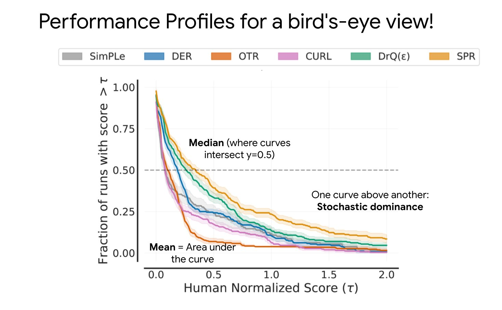

It is critical for Reinforcement Learning (RL) practitioners to properly evaluate and compare results.
Reporting results with poor comparison leads to a progress mirage and may underestimate the stochasticity of the results. To this end, [Deep RL at the Edge of the Statistical Precipice](https://arxiv.org/abs/2108.13264) (Neurips Oral) provides recommendations for a more rigorous evaluation of DeepRL algorithms. The paper comes with an open-source library named [rliable](https://github.com/google-research/rliable).

This blog post is meant to be a visual explanation of the tools used by the [rliable](https://agarwl.github.io/rliable/) library to better evaluate and compare RL algorithms.
We will go through the different recommendations of the authors and give a visual explanation for each of them.

## Score Normalization

To have more datapoints that just 10 random seeds, rliable recommends aggregating all N runs across all M tasks (e.g., aggregating all Atari games results) so we have a total of NxM runs from which we can sample from. To have comparable scores across tasks, we first need to normalize the scores of each run per task as follows:

<object width="100%" type="image/svg+xml" data="./score_norm.svg"></object>

Note: the score may depend on what you want to compare. It is usually the final performance of the RL agent, after training.

## Stratified Bootstrap Confidence Intervals

To account for uncertainty in aggregate performance, rliable uses stratified bootstrap confidence intervals.
This may sound complicated, but let's go slowly through the meaning of each of those terms.

First, bootstrap means sampling with replacement. For instance, if we sample four times with replacement 3 runs of indices [1, 2, 3] on a task A, we may get: [2, 2, 3, 1] the first time, [3, 1, 1, 1] the second time, ...

Stratified bootstrap means that we first group our datapoints into buckets (or strata), and then sample with replacement each of those buckets according to their size:

<object width="100%" type="image/svg+xml" data="./stratified_bootstrap.svg"></object>

In RL, the buckets are the different tasks or environments. With stratified bootstrap, all tasks are always represented in the sampled runs. This avoids computing the aggregate metrics only on a subset of all the environments:

<object width="100%" type="image/svg+xml" data="./bootstrap_rl.svg"></object>

Each time we sample with replacement the runs, we compute the different metrics (for instance, mean score) for those sampled runs. To report uncertainty, rliable computes [bootstrap confidence intervals](https://acclab.github.io/bootstrap-confidence-intervals.html) (CIs) following the [percentiles' method](https://ocw.mit.edu/courses/mathematics/18-05-introduction-to-probability-and-statistics-spring-2014/readings/MIT18_05S14_Reading24.pdf):

<object width="100%" type="image/svg+xml" data="./bootstrap_ci.svg"></object>

Note: there are other methods for computing CI with bootstrap, but percentiles was found by the authors to work well in practice.

## Interquartile Mean (IQM)

To summarize benchmark performance, it is common to report mean/median performance of the runs.
However, mean is known to be sensible to outliers and median may not reflect enough the distribution of scores, so rliable suggests to use Interquartile Mean (IQM) instead:

<object width="100%" type="image/svg+xml" data="./iqm.svg"></object>

## Performance Profiles

To report performance variability across tasks and runs, the authors proposes to use performance profiles.
It tells for a given target performance (for example, 60% of the reference performance) the proportion of runs that achieve it.

Source: image from the authors of the rliable library

## Probability of Improvement

Finally, to test whether an algorithm X is probably better or not than an algorithm Y, rliable uses the U-statistic from a [Mann–Whitney U test](https://en.wikipedia.org/wiki/Mann%E2%80%93Whitney_U_test):

<object width="100%" type="image/svg+xml" data="./proba_improvement.svg"></object>

The probability of improvement is then average over the tasks.
A probability of improvement around 0.5 means that the two algorithms have similar performances.

## In Practice: Using the RL Zoo

To allow more users to use rliable, we added basic support of it in the [RL Baselines3 Zoo](https://github.com/DLR-RM/rl-baselines3-zoo#plot-with-the-rliable-library), a training framework for [Stable-Baselines3](https://github.com/DLR-RM/stable-baselines3). Fore more information, please follow the instructions in the [README](https://github.com/DLR-RM/rl-baselines3-zoo#plot-with-the-rliable-library).

## Conclusion

In this post, we have seen the different tools used by rliable to better evaluate RL algorithms:
- score normalization to aggregate scores across tasks
- stratified bootstrap to provide proper confidence intervals
- interquartile mean (IQM) to summarize benchmark performance
- performance profile for an overview of the results and their variability
- probability of improvement to compare two algorithms

## Acknowledgement

I would like to thank [Pablo Samuel Castro](https://psc-g.github.io/) and [Rishabh Agarwal](https://agarwl.github.io/) for checking the correctness of the visuals.

All the graphics were made using [excalidraw](https://excalidraw.com/).

### Did you find this post helpful? Consider sharing it 🙌
