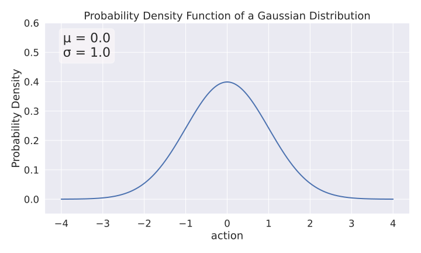
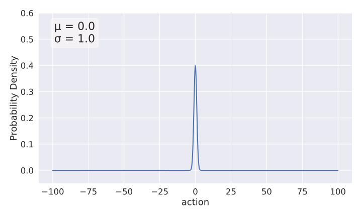

This is the story of how I managed to get the Soft-Actor Critic (SAC) and other off-policy reinforcement learning algorithms to work on massively parallel simulators (think Isaac Sim with thousands of robots simulated in parallel).
If you follow the journey, you will learn about overlooked details in task design and algorithm implementation that can have a big impact on performance.

Part I is about identifying the problem and trying out quick fixes on SAC.
Part II (WIP) will be about tuning SAC for speed and making it work as good as PPO.

<!-- <video controls>
 <source src="./tb_video.mp4" type="video/mp4">
Your browser does not support the video tag.
</video> -->


##  A Suspicious Trend: PPO, PPO, PPO, ...

The story begins a few months ago when I saw another paper using the same recipe for learning locomotion: train a PPO agent in simulation using thousands of environments in parallel and domain randomization, then deploy it on the real robot.
This recipe has become the standard since 2021, when ETH Zurich and NVIDIA[^rudin21] showed that it was possible to learn locomotion in minutes on a single workstation.
The codebase and the simulator (called Isaac Gym at that time) that were published became the basis for much follow-up work (:ref: google_scholar_walk_in_minutes, example Disney robot).

As an RL researcher focused on learning directly on real robots (no simulation, :ref: paper smooth), I was curious and suspicious about one aspect of this trend: why is no one trying an algorithm other than PPO?
PPO is not the only deep reinforcement learning (DRL) algorithm for continuous control tasks and there are alternatives like SAC or TQC that can lead to better performance (:ref: paper SAC/TQC/open rl bench).

So I decided to investigate why these off-policy algorithms are not used by practitioners, and maybe why they don't work with massively parallel simulators.

## Why It Matters? - Fine Tuning on Real Robots

If we could make SAC work with these simulators, then it would be possible to train in simulation and fine-tune on the real robot using the same algorithm (PPO is too sample-inefficient to train on a single robot) (footnote: which is the vision I have for RL and robotics).

By using other algorithms it might also be possible to get better performance.
Finally, it is always good to have a better understanding of what works or not and why.
As researchers, we tend to publish only positive results, but I think a lot of valuable insights are lost in our unpublished failures.

<a href="https://araffin.github.io/slides/design-real-rl-experiments/">
  
</a>
  <p style="font-size: 12pt; text-align:center;">The DLR bert elastic quadruped</p>

## (The Lazy Researcher) Hypothesis

Before digging any further, I had some hypotheses as to why PPO was the only algorithm used:
- PPO is fast to train (in terms of computation time) and was tuned for the massively parallel environment.
- Researchers tend to be lazy, so we tend to reuse things that work and build on them (the original training code is open source and the simulator is freely available).
- There may be some peculiarities in the environment design that favor PPO over algorithms. In other words, the massively parallel environments might be optimized for PPO.
- SAC/TQC and derivatives are tuned for sample efficiency, not fast wall clock time. In the case of massively parallel simulation, what matters is how long it takes to train, not how many samples are used. They probably need to be tuned/adjusted for this new setting.

Note: during my journey, I will (obviously) be using [Stable-Baselines3](https://github.com/DLR-RM/stable-baselines3) and its fast Jax version [SBX](https://github.com/araffin/sbx).

## The Hunt Begins

There are now many massively parallel simulators available (Isaac Sim, Brax, MJX, Genesis, ...), here, I chose to focus on Isaac Lab with Isaac Sim because it was one of the first and probably the most influential one.

As with any RL problem, starting simple is the key to success.

<video controls src="https://b2drop.eudat.eu/public.php/dav/files/z5LFrzLNfrPMd9o/ppo_trained.mp4">
</video>
<p style="font-size: 14pt; text-align:center;">A PPO agent trained on the <code>Isaac-Velocity-Flat-Unitree-A1-v0</code> locomotion task.
  <br>
  Green arrow is the desired velocity, blue arrow represents the current velocity
</p>


Therefore, I decided to focus on the `Isaac-Velocity-Flat-Unitree-A1-v0` locomotion task first, because it is simple but representative.
The goal is to learn a policy that can move the Unitree A1 quadruped in any direction on a flat ground, following a commanded velocity (the same way you would control a robot with a joystick).
The agent receives information about its current task as input (joint positions, velocities, desired velocity, ...) and outputs desired joint positions (12D vector, 3 joints per leg).
The robot is rewarded for following the correct desired velocity (linear and angular) and for other secondary tasks (feet air time, smooth control, ...).
An episode ends when the robot falls over and is timed out (truncation) after 1000 steps (60 Hz, 15s, https://github.com/isaac-sim/IsaacLab/blob/b1133e0591c2ef3a788c1ca148bb25a3f42562a9/source/isaaclab/isaaclab/sim/simulation_cfg.py#L227).
Or 200Hz? https://github.com/isaac-sim/IsaacLab/blob/f1a4975eb7bae8509082a8ff02fd775810a73531/source/isaaclab_tasks/isaaclab_tasks/manager_based/locomotion/velocity/velocity_env_cfg.py#L302

After some quick optimizations (SB3 now runs 4x faster, at 60 000 fps for 2048 envs with PPO), I did some sanity checks.
First, I ran PPO with the tuned hyperparameters found in the repo, and it was able to quickly solve the task.
In 5 minutes, it gets an average episode return of ~30 (above an episode return of 15, the task is almost solved).
Then I tried SAC and TQC, with default hyperparameters (and observation normalization), and, as expected, it didn't work.
No matter how long it was training, there was no sign of improvement.

Looking at the simulation GUI, something struck me: the robots were making very large random movements.
Something was wrong.

<video controls src="https://b2drop.eudat.eu/public.php/dav/files/z5LFrzLNfrPMd9o/limits_train.mp4">
</video>
<p style="font-size: 14pt; text-align:center;">SAC out of the box on Isaac Sim during training.</p>

Because of the very large movements, my suspicious was towards what action is the robot allowed to do.
Looking at the code, the RL agent commands a delta with respect to a default joint position:
```python
# Note desired_joint_pos is of dimension 12 (3 joints per leg)
desired_joint_pos = default_joint_pos + action
```
Note: in some other env, the RL action is scaled by some factor `desired_joint_pos = default_joint_pos + scale * action`.
TODO: in rad?
https://github.com/isaac-sim/IsaacLab/blob/f1a4975eb7bae8509082a8ff02fd775810a73531/source/isaaclab/isaaclab/envs/mdp/actions/joint_actions.py#L134

Then, let's look at the action space itself (I'm using `ipdb` to have an interactive debugger):
```python
import ipdb; ipdb.set_trace()
>> vec_env.action_space
Box(-100.0, 100.0, (12,), float32)
```
Ah ah!
The action space defines continuous actions of dimension 12 (nothing wrong here) but the limits $[-100, 100]$ are suprisingly large.
To understand why normalizing the action space matters (usually a bounded space in $[-1, 1]$), we have to dig more into how PPO works.


Unitree action scale: https://github.com/isaac-sim/IsaacLab/blob/f1a4975eb7bae8509082a8ff02fd775810a73531/source/isaaclab_tasks/isaaclab_tasks/manager_based/locomotion/velocity/config/a1/rough_env_cfg.py#L30

Joint pos for action:
https://github.com/isaac-sim/IsaacLab/blob/f1a4975eb7bae8509082a8ff02fd775810a73531/source/isaaclab_tasks/isaaclab_tasks/manager_based/locomotion/velocity/velocity_env_cfg.py#L112


## PPO Gaussian Distribution

[RL Tips and Tricks](https://stable-baselines3.readthedocs.io/en/master/guide/rl_tips.html)
[RLVS Video](https://www.youtube.com/watch?v=Ikngt0_DXJg)
[Designing and running real world rl experiments](https://www.youtube.com/watch?v=eZ6ZEpCi6D8)

Like many RL algorithms, PPO relies on a probability distribution to select actions.
During training, at each timestep, it samples an action $a_t \sim N(\mu_\theta(s_t), \sigma^2)$ from a Gaussian distribution in the case of continuous actions.
The mean of the Gaussian $\mu_\theta(s_t)$ is the output of the actor neural network (with parameters $\theta$) and the standard deviation is a learnable parameter $\sigma$, usually initialized with $\sigma_0 = 1.0$.

This means that at the beginning of training, most of the sampled actions will be in $[-3, 3]$ (from the [Three Sigma Rule](https://en.wikipedia.org/wiki/68%E2%80%9395%E2%80%9399.7_rule)):


<p style="font-size: 14pt; text-align:center;">The initial Gaussian distribution used by PPO for sampling actions.</p>


Back to our original topic, because of the way $\sigma$ is initialized, if the action space has large bounds (upper/lower bounds >> 1), PPO will almost never sample actions near the limits.
In practice, the actions taken by PPO will even be far away from them.
Now let's put the initial PPO action distribution into perspective with the Unitree A1 action space:


<p style="font-size: 14pt; text-align:center;">The same initial Gaussian distribution but with the perspective of the Unitree A1 action space $[-100, 100]$</p>

For reference, we can plot the action distribution of PPO after training:

TODO: image of the distribution of the first 3 actions (or even the 12?)

Again, most of the actions are centered around zero (which makes sense at it corresponds to the quadruped initial position, normally chosen to be stable) and there is no actions outside $[-5, 5]$: PPO is using less that 5% of the action space!

Now that we know we need less than 5% of the action space to solve the task, let's see why this might explain why SAC doesn't work in that case.

Note: too small action spaces are also a problem
Note: if in rad, 3 rad is already 171 degrees (but action scale = 0.25, so ~40 deg, action scale = 0.5 for Anymal).

## SAC Squashed Gaussian

SAC and other off-policy algorithms for continous actions (like DDPG, TD3 or [TQC](https://sb3-contrib.readthedocs.io/en/master/modules/tqc.html)) have an additional transformation at the end of the actor network.
SAC squashes the action sampled from an unbounded Gaussian distribution using a [$tanh()$](https://pytorch.org/docs/stable/generated/torch.nn.Tanh.html) function.
Therefore the sampled action is always in $[-1, 1]$.
SAC then linearly rescale the sampled action to match the action space definition, i.e. it transform the action from $[-1, 1]$ to $[low, high]$ using `action = low + (0.5 * (scaled_action + 1.0) * (high - low))`.

What does that mean?
Assuming we start with a standard deviation similar to PPO, this is how the sampled action distribution look like after squashing:

TODO: squashed gaussian

And after rescaling to the environment limits (with PPO distribution to put in perspective):

TODO: squashed Gaussian in [-100, 100] with PPO Gaussian dist

As you can see, those are two completely different initial distributions at the beginning of training!
The fact that action are rescaled to match the action space bounds explains the very large movements seen during training, and also explain why it was impossible for SAC to learn anything useful.

## Quick Fix

When I discovered that the action limits were way too large, my first reflex was to re-train SAC but with only 3% of the action space, to match more or less PPO effective action space.
Although it didn't reach PPO performance, there was finally some sign of life (an average episodic return slightly positive after a while).

What I tried next was to reduce SAC exploration by having a smaller entropy coefficient at the beginning of training.
Bingo!
SAC finally learned to solve the task!

TODO: image learning curve

Note: the entropy coeff is the coeff that does the trade-off between RL objective and entropy maximization

<video controls src="https://b2drop.eudat.eu/public.php/dav/files/z5LFrzLNfrPMd9o/sac_trained_cut_1.mp4">
</video>
<p style="font-size: 14pt; text-align:center;">Trained SAC agent after the quick fix.</p>


## That's all folks?

SAC works but not as fast as PPO, performance slightly below, weird movements (leg up in the air), not reliably.
Part II will explore those aspects (and more envs), SAC design decision (trying to remove the squashed Gaussian), but for now let's see what this mean for the RL community.

## Outro: What Does That Mean for the RL Community?

Other affected papers/envs.
Brax not affected but special PPO implementation too.
PPO worked by accident?
Recommendation: use the action dist plotter (link to gist), define proper action bounds.

TODO: get feedback if this is an overlooked problem or known issue but PPO is nice because it can decide which action space to choose?

Quick tuning: use TQC (equal or better perf than SAC), faster training with JIT and multi gradient steps, policy delay and train_freq, bigger batch size.
Some more digging: very large action space compared to PPO initialization.
Quick fix: use 2% of the action space: first sign of life.
Reduce initial value of entropy coeff for faster convergence.
TODO: talk about handling truncation properly, and link to video

Note: entropy coeff is inverse reward scale in maximum entropy RL

## Tuning for speed

Automatic hyperparameter optimization with Optuna.
Good and fast results (not as fast as PPO but more sample efficient).
Try schedule of action space (start small and make it bigger over time): not so satifying,
looking into unbounded action space.


## PPO Gaussian dist vs Squashed Gaussian

How PPO samples action vs SAC implementation (Note: not true for brax, footnote needed)
and why it is bad to have unbounded/wrong limits.

Need to plot distribution of actions over time (start of training, mid-training, end)
and show difference between squashed Gaussian samples (the boundaries are more samples) and clipped Gaussian.

Difference between log std computation (state-dependent with clipping vs independent global param).

Trying to make SAC looks like PPO, move to unbounded Gaussian dist, instabilities.
Fixes: clip max action, l2 loss (like [SAC original implementation](https://github.com/haarnoja/sac/blob/8258e33633c7e37833cc39315891e77adfbe14b2/sac/distributions/normal.py#L69-L70))
Replace state-dependent std with independent: auto-tuning entropy coeff broken, need to fix it (TODO: investigate why).

<!-- SAC initial commit https://github.com/haarnoja/sac/blob/fa226b0dcb244d69639416995311cc5b4092c8f7/sac/distributions/gmm.py#L122 -->


<object width="100%" type="image/svg+xml" data="./img/grid_search_comb.svg"></object>

Note: SAC work on MuJoCo like env

Note: two variations of the same issue: unbounded (macthes Gaussian dist real domain)
and clipped to high limits

Note: brax PPO seems to implement tanh Gaussian dist (action limited to [-1, 1]): 
https://github.com/google/brax/blob/241f9bc5bbd003f9cfc9ded7613388e2fe125af6/brax/training/agents/ppo/networks.py#L78
MuJoCo playground and Brax clip: https://github.com/google-deepmind/mujoco_playground/blob/0f3adda84f2a2ab55e9d9aaf7311c917518ec25c/mujoco_playground/_src/wrapper_torch.py#L158
but not really defined explicitly in the env (for the limits)

Note: rescale action doesn't work for PPO, need retuning? need tanh normal?

Affected envs:
<!-- - [MuJoCo Playground](https://github.com/google-deepmind/mujoco_playground/blob/0f3adda84f2a2ab55e9d9aaf7311c917518ec25c/mujoco_playground/_src/locomotion/go1/joystick.py#L239) -->
<!-- https://github.com/Argo-Robot/quadrupeds_locomotion/blob/45eec904e72ff6bafe1d5378322962003aeff88d/src/go2_env.py#L173 -->
<!-- https://github.com/leggedrobotics/legged_gym/blob/17847702f90d8227cd31cce9c920aa53a739a09a/legged_gym/envs/base/legged_robot.py#L85 -->
- [IsaacLab](https://github.com/isaac-sim/IsaacLab/blob/c4bec8fe01c2fd83a0a25da184494b37b3e3eb61/source/isaaclab_rl/isaaclab_rl/sb3.py#L154)
- [Learning to Walk in Minutes](https://github.com/leggedrobotics/legged_gym/blob/17847702f90d8227cd31cce9c920aa53a739a09a/legged_gym/envs/base/legged_robot_config.py#L164 )
- [One Policy to Run Them All](https://github.com/nico-bohlinger/one_policy_to_run_them_all/blob/d9d166c348496c9665dd3ebabc20efb6d8077161/one_policy_to_run_them_all/environments/unitree_a1/environment.py#L140)
- [Genesis env](https://github.com/Argo-Robot/quadrupeds_locomotion/blob/45eec904e72ff6bafe1d5378322962003aeff88d/src/go2_train.py#L104)
- [ASAP Humanoid](https://github.com/LeCAR-Lab/ASAP/blob/c78664b6d2574f62bd2287e4b54b4f8c2a0a47a5/humanoidverse/config/robot/g1/g1_29dof_anneal_23dof.yaml#L161)
- [Agile But Robust](https://github.com/LeCAR-Lab/ABS/blob/9b95329ffb823c15dead02be620ff96938e4d0a3/training/legged_gym/legged_gym/envs/base/legged_robot_config.py#L169)
- [Rapid Locomotion](https://github.com/Improbable-AI/rapid-locomotion-rl/blob/f5143ef940e934849c00284e34caf164d6ce7b6e/mini_gym/envs/base/legged_robot_config.py#L209)
- [Deep Whole Body Control](https://github.com/MarkFzp/Deep-Whole-Body-Control/blob/8159e4ed8695b2d3f62a40d2ab8d88205ac5021a/legged_gym/legged_gym/envs/widowGo1/widowGo1_config.py#L114)
- [Robot Parkour Learning](https://github.com/ZiwenZhuang/parkour/blob/789e83c40b95fdd49fda7c1725c8c573df42d2a9/legged_gym/legged_gym/envs/base/legged_robot_config.py#L169)

Probably many more looking at [works that cite ETH paper](https://scholar.google.com/scholar?cites=8503164023891275626&as_sdt=2005&sciodt=0,5)

Seems to be fixed in [Extreme Parkour](https://github.com/chengxuxin/extreme-parkour/blob/d2ffe27ba59a3229fad22a9fc94c38010bb1f519/legged_gym/legged_gym/envs/base/legged_robot_config.py#L120) (clip action 1.2)
Almost fixed in [Walk this way](https://github.com/Improbable-AI/walk-these-ways/blob/0e7236bdc81ce855cbe3d70345a7899452bdeb1c/scripts/train.py#L200) (clip action 10)

Links:

- https://forums.developer.nvidia.com/t/poor-performance-of-soft-actor-critic-sac-in-omniverseisaacgym/266970
- https://www.reddit.com/r/reinforcementlearning/comments/lcx0cm/scaling_up_sac_with_parallel_environments/
- https://www.reddit.com/r/reinforcementlearning/comments/12h1faq/isaac_gym_with_offpolicy_algorithms/

Related:
- [Parallel Q Learning (PQL)](https://github.com/Improbable-AI/pql) but only tackles classic MuJoCo locomotion envs


## Citation

```
@article{raffin2025isaacsim,
  title   = "Getting SAC to Work on a Massive Parallel Simulator: An RL Journey With Off-Policy Algorithms",
  author  = "Raffin, Antonin",
  journal = "araffin.github.io",
  year    = "2025",
  month   = "Feb",
  url     = "https://araffin.github.io/post/sac-massive-sim/"
}
```

## Acknowledgement

All the graphics were made using [excalidraw](https://excalidraw.com/).


### Did you find this post helpful? Consider sharing it 🙌

## References

[^rudin21]: Rudin, Nikita, et al. "Learning to walk in minutes using massively parallel deep reinforcement learning." Conference on Robot Learning. PMLR, 2022.
