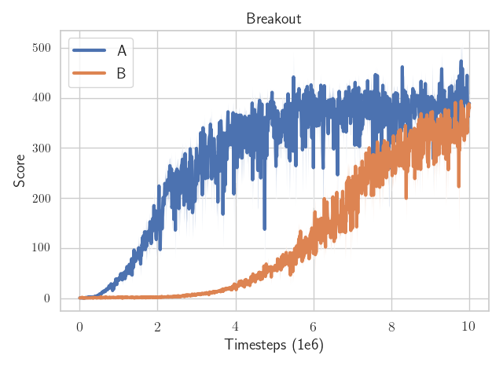

After several months of beta, we are happy to announce the release of [Stable-Baselines3 (SB3)](https://github.com/DLR-RM/stable-baselines3) v1.0, a set of reliable implementations of reinforcement learning (RL) algorithms in PyTorch =D! It is the next major version of [Stable Baselines](https://github.com/hill-a/stable-baselines).

The implementations have been [benchmarked](https://arxiv.org/abs/2005.05719) against reference codebases, and automated unit tests cover 95% of the code.

In this blog post, we give you an overview of Stable-Baselines3: the motivation behind it, its design principles and features, how we ensure high-quality implementations and some concrete examples.

<!-- The algorithms follow a consistent interface and are accompanied by extensive documentation, making it simple to train and compare different RL algorithms. -->

## TL;DR:

[Stable-Baselines3 (SB3)](https://github.com/DLR-RM/stable-baselines3) is a library providing *reliable* implementations of reinforcement learning algorithms in PyTorch. It provides a *clean and simple interface*, giving you access to off-the-shelf state-of-the-art model-free RL algorithms.

The library is *[fully documented](https://stable-baselines3.readthedocs.io/en/master/)*, tested and its interface allows to train an RL agent in only few lines of code =):

```python
import gym
from stable_baselines3 import SAC
# Train an agent using Soft Actor-Critic on Pendulum-v0
env = gym.make("Pendulum-v0")
model = SAC("MlpPolicy", env, verbose=1)
# Train the model
model.learn(total_timesteps=20000)
# Save the model
model.save("sac_pendulum")
# Load the trained model
model = SAC.load("sac_pendulum")
# Start a new episode
obs = env.reset()
# What action to take in state `obs`?
action, _ = model.predict(obs, deterministic=True)
```

where defining and training a RL agent can be written in two lines of code:

```python
from stable_baselines3 import PPO
# Train an agent using Proximal Policy Optimization on CartPole-v1
model = PPO("MlpPolicy", "CartPole-v1").learn(total_timesteps=20000)
```

## Links

GitHub repository: [https://github.com/DLR-RM/stable-baselines3](https://github.com/DLR-RM/stable-baselines3)

Paper: [http://jmlr.org/papers/v22/20-1364.html](http://jmlr.org/papers/v22/20-1364.html)

Documentation: [https://stable-baselines3.readthedocs.io/](https://stable-baselines3.readthedocs.io/)

RL Baselines3 Zoo: [https://github.com/DLR-RM/rl-baselines3-zoo](https://github.com/DLR-RM/rl-baselines3-zoo)

Contrib: [https://github.com/Stable-Baselines-Team/stable-baselines3-contrib](https://github.com/Stable-Baselines-Team/stable-baselines3-contrib)

RL Tutorial: [https://github.com/araffin/rl-tutorial-jnrr19](https://github.com/araffin/rl-tutorial-jnrr19)

## Motivation

Deep reinforcement learning (RL) research has grown rapidly in recent years, yet results are often [difficult to reproduce](https://arxiv.org/abs/1709.06560).
A major challenge is that small implementation details can have a substantial effect on performance -- often greater than the [difference between algorithms](https://iclr.cc/virtual_2020/poster_r1etN1rtPB.html).
It is particularly important that implementations used as experimental *baselines* are reliable; otherwise, novel algorithms compared to weak baselines lead to inflated estimates of performance improvements.

To help with this problem, we present Stable-Baselines3 (SB3), an open-source framework implementing seven commonly used model-free deep RL algorithms, relying on the [OpenAI Gym interface](https://github.com/openai/gym).

We take great care to adhere to software engineering best practices to achieve high-quality implementations that match prior results.

## History

SB3 builds on our experience maintaining *[Stable Baselines](https://github.com/hill-a/stable-baselines)* (SB2), a fork of OpenAI Baselines built on TensorFlow 1.x.
If you haven't heard of it, Stable-Baselines (SB2) is a trusted library and has already been used in *many [projects](https://stable-baselines.readthedocs.io/en/master/misc/projects.html)* and *[papers](https://scholar.google.fr/scholar?oi=bibs&hl=fr&cites=7029285800852969820)* with already more than 300+ citations!

Those two years of maintaining SB2 have been a rewarding exchange with our users, where tons of bugs where fixed and new features like callbacks where added to ease the use of the library.

However, SB2 was still relying on OpenAI Baselines initial codebase and with the upcoming release of Tensorflow 2, more and more internal TF code was being deprecated.

After discussing the matter with the community, we decided to go for a complete rewrite in PyTorch (cf issues [#366](https://github.com/hill-a/stable-baselines/issues/366), [#576](https://github.com/hill-a/stable-baselines/issues/576) and [#733](https://github.com/hill-a/stable-baselines/issues/733)), codename: Stable-Baselines3<sup>1</sup>.

Stable-Baselines3 keeps the same easy-to-use API while improving a lot on the internal code, in particular by adding static type checking.

Re-starting almost from scratch is long-term investment: it took [quite some effort](https://github.com/DLR-RM/stable-baselines3/issues/1) and time but we now have a smaller, cleaner and reliable core that is easier to maintain and extend =).

There are already [many](https://github.com/search?p=1&q=reinforcement+learning+library&type=Repositories) open source reinforcement learning libraries (almost one new every week), so why did we create a new one? In the next sections you will learn about the design principles and main features of the Stable-Baselines3 library that differenciate it from others.

<sup>1</sup> The very first name of the new version was "torchy-baselines"

## Design Principles

Our main goal is to provide a user-friendly and reliable RL library.
To keep SB3 simple to use and maintain, we focus on model-free, single-agent RL algorithms, and rely on external projects to extend the scope to [imitation](https://github.com/HumanCompatibleAI/imitation) and [offline](https://github.com/takuseno/d3rlpy) learning.

We prioritize maintaining *stable* implementations over adding new features or algorithms, and avoid making breaking changes.
We provide a consistent, clean and fully documented API, inspired by the [scikit-learn](https://scikit-learn.org/stable/) API.

Our code is [easily modifiable](https://stable-baselines3.readthedocs.io/en/master/guide/developer.html) by users as we favour readability and simplicity over modularity, although we make use of object-oriented programming to reduce code duplication.

## Features

Stable-Baselines3 provides many features, ranging from a simple API to a complete [experimental framework](https://github.com/DLR-RM/rl-baselines3-zoo) that allows advanced usage like automatic hyperparameters tuning.

### Simple API

Training agents in Stable-Baselines3 takes just a few lines of code, after which the agent can be queried for actions (see quick example below).
This allows you to easily use the baseline algorithms and components in your experiments (eg. [Imitating Animals](https://xbpeng.github.io/projects/Robotic_Imitation/index.html), [Slime Volleyball](https://github.com/hardmaru/slimevolleygym), [Adversarial Policies](https://adversarialpolicies.github.io/)), as well as apply RL to novel tasks and environments, like [continual learning](https://pwnagotchi.ai/) when attacking WiFi networks or [dampening bridge vibrations](https://github.com/jaberkow/WaveRL).

```python
import gym

from stable_baselines3 import A2C
from stable_baselines3.common.monitor import Monitor
from stable_baselines3.common.callbacks import CheckpointCallback, EvalCallback

# Save a checkpoint every 1000 steps
checkpoint_callback = CheckpointCallback(save_freq=5000, save_path="./logs/",
                                         name_prefix="rl_model")

# Evaluate the model periodically
# and auto-save the best model and evaluations
# Use a monitor wrapper to properly report episode stats
eval_env = Monitor(gym.make("LunarLander-v2"))
# Use deterministic actions for evaluation
eval_callback = EvalCallback(eval_env, best_model_save_path="./logs/",
                             log_path="./logs/", eval_freq=2000,
                             deterministic=True, render=False)

# Train an agent using A2C on LunarLander-v2
model = A2C("MlpPolicy", "LunarLander-v2", verbose=1)
model.learn(total_timesteps=20000, callback=[checkpoint_callback, eval_callback])

# Retrieve and reset the environment
env = model.get_env()
obs = env.reset()

# Query the agent (stochastic action here)
action, _ = model.predict(obs, deterministic=False)

```

### Documentation

SB3 comes with [extensive documentation](https://stable-baselines3.readthedocs.io/en/master/) of the code API.
We also include a user guide, covering both basic and more advanced usage with a collection of concrete examples.
Moreover, we have developed a [Colab notebook based RL tutorial](https://github.com/araffin/rl-tutorial-jnrr19), so you can demo the library directly in the browser.
Additionally, we include [common tips](https://stable-baselines3.readthedocs.io/en/master/guide/rl_tips.html) for running RL experiments and a [developer guide](https://stable-baselines3.readthedocs.io/en/master/guide/developer.html).

We also pay close attention to [questions](https://github.com/DLR-RM/stable-baselines3/issues?q=is%3Aissue+is%3Aopen+label%3Aquestion) and [uncertainties](https://github.com/DLR-RM/stable-baselines3/issues?q=is%3Aissue+is%3Aopen+label%3Adocumentation) from SB3 users, updating the documentation to address these.


*Stable-Baselines3 Documentation*


### High-Quality Implementations

Algorithms are verified against published results by comparing the agent learning curves (cf issues [#48](https://github.com/DLR-RM/stable-baselines3/issues/48) and [#48](https://github.com/DLR-RM/stable-baselines3/issues/49)).

As an example, to compare against TD3 and SAC original implementation, we integrated SB3 callbacks and made sure both SB3 and original implementations were using the same hyperparameters (the code diff for SAC and TD3 repos can be found [here](https://github.com/rail-berkeley/softlearning/compare/master...Artemis-Skade:master) and [there](https://github.com/sfujim/TD3/compare/master...araffin:master)).

<!-- https://github.com/Artemis-Skade/softlearning -->
<!-- https://github.com/araffin/TD3 -->

During this period, that's how we realized some tricky details that made a big difference.
For example, PyTorch RMSProp is different from TensorFlow one (we include a [custom version](https://github.com/DLR-RM/stable-baselines3/blob/master/stable_baselines3/common/sb2_compat/rmsprop_tf_like.py) inside our codebase), and the `epsilon` value of the optimizer can make a [big difference](https://twitter.com/araffin2/status/1329382226421837825):


*A and B are actually the same RL algorithm (A2C), sharing the exact same code, same hardware, same hyperparameters... except the epsilon value to avoid division by zero in the optimizer (one is `eps=1e-5`, the other `eps=1e-7`)*


Despite all those tricky details (and other [nasty bugs](https://github.com/DLR-RM/stable-baselines3/issues/105)), at the end, we managed to match SB2 results and original implementations closely:


*Stable-Baselines (SB2) vs Stable-Baselines3 (SB3) A2C result on CartPole-v1*


*Stable-Baselines (SB2) vs Stable-Baselines3 (SB3) results on BreakoutNoFrameskip-v4*


*Stable-Baselines3 (SB3) vs original implementations results on HalfCheetahBulletEnv-v0*

<!-- Moreover, all functions are typed (parameter and return types) and documented with a consistent style, and most functions are covered by unit tests. -->

<!-- Continuous integration checks that all changes pass unit tests and type check, as well as validating the code style and documentation. -->

### Comprehensive

Stable-Baselines3 contains the following state-of-the-art on- and off-policy algorithms, commonly used as experimental baselines: A2C, DDPG, DQN, HER, PPO, SAC and TD3.

Moreover, SB3 provides various algorithm-independent features. We support logging to CSV files and [TensorBoard](https://stable-baselines3.readthedocs.io/en/master/guide/tensorboard.html). Users can log custom metrics and modify training via user-provided [callbacks](https://stable-baselines3.readthedocs.io/en/master/guide/callbacks.html).

To speed up training, we support parallel (or "vectorized") environments. To simplify training, we implement common environment wrappers, like preprocessing Atari observations to match the original DQN experiments.

<video controls>
 <source src="./tb_video.mp4" type="video/mp4">
Your browser does not support the video tag.
</video>

*Tensorboard video integration*


### Experimental Framework

[RL Baselines Zoo](https://github.com/DLR-RM/rl-baselines3-zoo) provides scripts to train and evaluate agents, tune hyperparameters, record videos, store experiment setup and visualize results.
We also include a collection of pre-trained reinforcement learning agents together with tuned hyperparameters for simple control tasks, [PyBullet](https://github.com/bulletphysics/bullet3/tree/master/examples/pybullet/gym/pybullet_envs) environments and Atari games, optimized using [Optuna](https://github.com/pfnet/optuna).

We follow best practices for training and evaluation, such as evaluating in a separate environment, using deterministic evaluation where required (SAC) and storing all hyperparameters necessary to replicate the experiment.

Below, you can see basic usage of the RL zoo (training, loading, tuning hyperparameters), which has a simple command line:

```bash
# Train an A2C agent on Atari breakout using tuned hyperparameters,
# evaluate the agent every 10k steps and save a checkpoint every 50k steps
python train.py --algo a2c --env BreakoutNoFrameskip-v4 \
    --eval-freq 10000 --save-freq 50000
# Plot the learning curve
python scripts/all_plots.py -a a2c -e BreakoutNoFrameskip-v4 -f logs/

# Load and evaluate a trained agent for 1000 steps
# optionally, you can also load a checkpoint using --load-checkpoint
python enjoy.py --algo sac --env Pendulum-v0 -n 1000

# Tune the hyperparameters of ppo on BipedalWalker-v3 with a budget of 50 trials
# using 2 parallel jobs, a TPE sampler and median pruner
python train.py --algo ppo --env BipedalWalker-v3 -optimize --n-trials 50 \
    --n-jobs 2 --sampler tpe --pruner median

```


### Stable-Baselines3 Contrib

We implement experimental features in a separate [contrib repository](https://github.com/Stable-Baselines-Team/stable-baselines3-contrib).
This allows SB3 to maintain a stable and compact core, while still providing the latest features, like [Quantile Regression DQN (QR-DQN)](https://sb3-contrib.readthedocs.io/en/master/modules/qrdqn.html) or [Truncated Quantile Critics (TQC)](https://sb3-contrib.readthedocs.io/en/master/modules/tqc.html).

Implementations in contrib need not be tightly integrated with the main SB3 codebase, but we maintain the same stringent review requirements to ensure users can trust the contrib implementations.
Implementations from contrib that have stood the test of time may be integrated into the main repository.

```python
from sb3_contrib import QRDQN, TQC

# Train an agent using QR-DQN on Acrobot-v0
model = QRDQN("MlpPolicy", "Acrobot-v0").learn(total_timesteps=20000)
# Train an agent using Truncated Quantile Critics on Pendulum-v0
model = TQC("MlpPolicy", "Pendulum-v0").learn(total_timesteps=20000)
```

<!-- ## What's new? -->

## Migration from Stable-Baselines (SB2)

If you are Stable-Baselines (SB2) user and would like to switch to SB3, we have a [migration guide](https://stable-baselines3.readthedocs.io/en/master/guide/migration.html) waiting for you ;)

Most of the time, it only requires to change the import `from stable_baselines` by `from stable_baselines3` and rename some parameters.

For instance, if your code was like that for Stable-Baselines:

```python
from stable_baselines import PPO2
from stable_baselines.common.cmd_util import make_atari_env

env = make_atari_env("BreakoutNoFrameskip-v4", num_env=8, seed=21)

model = PPO2("MlpPolicy", env, n_steps=128, nminibatches=4,
              noptepochs=4, ent_coef=0.01, verbose=1)

model.learn(int(1e5))
```

the corresponding SB3 code is:

```python
from stable_baselines3 import PPO
# cmd_util was renamed env_util for clarity
from stable_baselines3.common.env_util import make_atari_env

# num_env was renamed n_envs
env = make_atari_env("BreakoutNoFrameskip-v4", n_envs=8, seed=21)

# we use batch_size instead of nminibatches which
# was dependent on the number of environments
# batch_size = (n_steps * n_envs) // nminibatches = 256
# noptepochs was renamed n_epochs
model = PPO("MlpPolicy", env, n_steps=128, batch_size=256,
            n_epochs=4, ent_coef=0.01, verbose=1)

model.learn(int(1e5))
```

For a complete migration example, you can also compare the [RL Zoo of SB2](https://github.com/araffin/rl-baselines-zoo) with the [one from SB3](https://github.com/DLR-RM/rl-baselines3-zoo).


<div style="margin-top:3em"></div>

<hr/>

<div style="margin-top:3em"></div>


## Examples

Let's see now how we can now use the library in practice with some examples. We're going to see how to easily customize the network architecture, train an agent to play Atari games and normalize observations when training on continuous control tasks like PyBullet environments.

For each of them, you can try it online using [Google colab notebook](https://github.com/Stable-Baselines-Team/rl-colab-notebooks/tree/sb3).


### Custom Policy Network

To[customize a policy](https://stable-baselines3.readthedocs.io/en/master/guide/custom_policy.html) with SB3, all you need to do is choose a network architecture and pass a `policy_kwargs` ("policy keyword arguments") to the algorithm constructor.

The following snippet shows how to customize the architecture and activation function for one on-policy (PPO) and one off-policy (SAC) algorithm:


```python
import torch as th

from stable_baselines3 import PPO, SAC

# Custom actor (pi) and value function (vf) networks
# of two layers of size 32 each with Relu activation function
policy_kwargs = dict(activation_fn=th.nn.ReLU,
                     net_arch=dict(pi=[32, 32], vf=[32, 32]))
# Create the agent
model = PPO("MlpPolicy", "CartPole-v1", policy_kwargs=policy_kwargs, verbose=1)

# Custom actor architecture with two layers of 64 units each
# Custom critic architecture with two layers of 400 and 300 units
policy_kwargs = dict(net_arch=dict(pi=[64, 64], qf=[400, 300]))
# Create the agent
model = SAC("MlpPolicy", "Pendulum-v0", policy_kwargs=policy_kwargs, verbose=1)
model.learn(5000)
```

### Atari Games

Training a RL agent on Atari games is straightforward thanks to `make_atari_env` helper function and the [VecFrameStack](https://stable-baselines3.readthedocs.io/en/master/guide/vec_envs.html#vecframestack) wrapper. It will do all the [preprocessing](https://stable-baselines3.readthedocs.io/en/master/common/atari_wrappers.html) and multiprocessing for you.

Colab link: [Try it online](https://colab.research.google.com/github/Stable-Baselines-Team/rl-colab-notebooks/blob/sb3/atari_games.ipynb)

```python

from stable_baselines3.common.env_util import make_atari_env
from stable_baselines3.common.vec_env import VecFrameStack
from stable_baselines3 import A2C

# There already exists an environment generator
# that will make and wrap atari environments correctly.
# Here we are also multi-worker training (n_envs=4 => 4 environments)
env = make_atari_env('PongNoFrameskip-v4', n_envs=4, seed=0)
# Frame-stacking with 4 frames
env = VecFrameStack(env, n_stack=4)

model = A2C('CnnPolicy', env, verbose=1)
model.learn(total_timesteps=25000)

obs = env.reset()
while True:
    # By default, deterministic=False, so we use the stochastic policy
    action, _states = model.predict(obs)
    obs, rewards, dones, info = env.step(action)
    env.render()
```

### PyBullet: Normalizing Input Features

Normalizing input features may be essential to successful training of an RL agent (by default, images are scaled but not other types of input), for instance when training on [PyBullet](https://github.com/bulletphysics/bullet3/) environments. For that, a wrapper exists and will compute a running average and standard deviation of input features (it can do the same for rewards).


Colab link: [Try it online](https://colab.research.google.com/github/Stable-Baselines-Team/rl-colab-notebooks/blob/sb3/pybullet.ipynb)

```python
import os
import gym
import pybullet_envs

from stable_baselines3.common.vec_env import DummyVecEnv, VecNormalize
from stable_baselines3 import PPO

env = DummyVecEnv([lambda: gym.make("HalfCheetahBulletEnv-v0")])
# Automatically normalize the input features and reward
env = VecNormalize(env, norm_obs=True, norm_reward=True,
                   clip_obs=10.)

model = PPO('MlpPolicy', env)
model.learn(total_timesteps=2000)

# Don't forget to save the VecNormalize statistics when saving the agent
log_dir = "/tmp/"
model.save(log_dir + "ppo_halfcheetah")
stats_path = os.path.join(log_dir, "vec_normalize.pkl")
env.save(stats_path)

# To demonstrate loading
del model, env

# Load the agent
model = PPO.load(log_dir + "ppo_halfcheetah")

# Load the saved statistics
env = DummyVecEnv([lambda: gym.make("HalfCheetahBulletEnv-v0")])
env = VecNormalize.load(stats_path, env)
#  do not update them at test time
env.training = False
# reward normalization is not needed at test time
env.norm_reward = False

```

### More Examples

You can find more examples and associated colab notebooks in the [documentation](https://stable-baselines3.readthedocs.io/en/master/guide/examples.html).

## To the Infinity and Beyond!

We presented Stable-Baselines3 v1.0, a set of reliable reinforcement learning implementations and the next major version of the Stable-Baselines.

If you want to follow the updates of the library, we encourage you to star the repo on [GitHub](https://github.com/DLR-RM/stable-baselines3) and click on "Watch -> Custom -> Releases" to be notified each time a new version is released ;) (you can also follow [Adam](https://twitter.com/ARGleave) or [Antonin](https://twitter.com/araffin2) on Twitter).
Coming soon, one of our long-time requested feature: [mixed observations](https://github.com/DLR-RM/stable-baselines3/pull/243) (aka dict obs) support.

In case you want to contribute, make sure to read the [contributing guide](https://github.com/DLR-RM/stable-baselines3/blob/master/CONTRIBUTING.md) first.

Finally, if you make a cool project using Stable-Baselines3, please tell us when you want it to appear in [our project page](https://stable-baselines3.readthedocs.io/en/master/misc/projects.html).


## About the Authors

This blog post was co-written by Stable-Baselines3 maintainers:

- [Antonin Raffin](https://github.com/araffin) (@araffin)
- [Ashley Hill](https://github.com/hill-a) (@hill-a)
- [Maximilian Ernestus](https://github.com/ernestum) (@ernestum)
- [Adam Gleave](https://github.com/adamgleave) (@AdamGleave)
- [Anssi Kanervisto](https://github.com/Miffyli) (@Miffyli).

## Citing the Project

To cite Stable-Baselines3 in publications:

```
@article{stable-baselines3,
  author  = {Antonin Raffin and Ashley Hill and Adam Gleave and Anssi Kanervisto and Maximilian Ernestus and Noah Dormann},
  title   = {Stable-Baselines3: Reliable Reinforcement Learning Implementations},
  journal = {Journal of Machine Learning Research},
  year    = {2021},
  volume  = {22},
  number  = {268},
  pages   = {1-8},
  url     = {http://jmlr.org/papers/v22/20-1364.html}
}
```

### Did you find this post helpful? Consider sharing it 🙌
