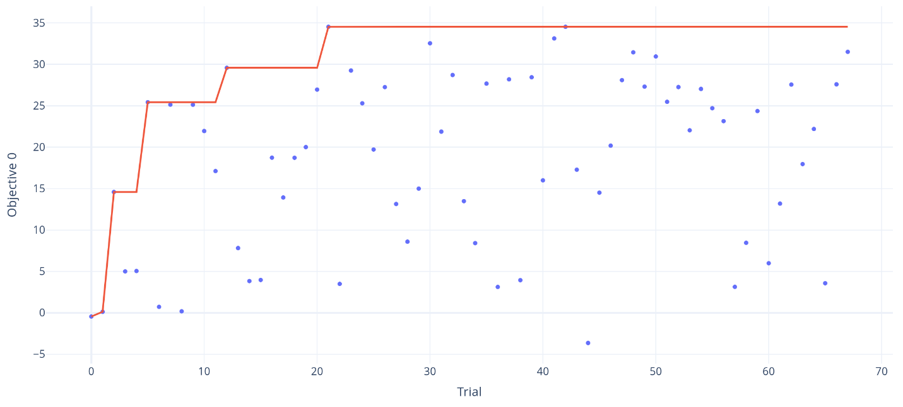

This second post details how I tuned the Soft-Actor Critic (SAC) algorithm to learn as fast as PPO in the context of a massively parallel simulator (thousands of robots simulated in parallel).
If you read along, you will learn how to automatically tune SAC for speed, how to find better action boundaries, and what I tried that didn't work.

If you haven't read it yet, please have a look at [part I](https://araffin.github.io/post/sac-massive-sim/) which is about analysing why SAC doesn't work how of the box on Isaac Sim environments.

## In the Previous Episode...

In the [first part](https://araffin.github.io/post/sac-massive-sim/), I stopped at the point where we could detect some signs of life from SAC (it was learning something).

By limiting the action space limits to 3% of the original size, and quickly tuning SAC (bigger network, reduced initial exploration rate), I could get SAC to learn to solve the Unitree A1 task on a flat surface in a matter of minutes.

However, SAC took more time to train than PPO (12 minutes vs. 6 minutes), and it did not reach PPO's performance level.
Luckily, I still had several ideas for improving SAC's training speed and performance[^didnt-work].


## Defining Proper Action Bound - Extracting the Limits with PPO

An aspect I wanted to improve was properly defining the boundaries of the action space.
In part one, I quickly fixed it by limiting the action space to 3% of the original.
For a more precise definition, I [recorded](https://gist.github.com/araffin/e069945a68aa0d51fcdff3f01e945c70) the actions taken by a trained PPO agent and took the 2.5th and 97.5th percentile for the new limits.
In other words, the new action space contains 95% of the actions commanded by a trained PPO agent[^define-space]:
```python
# np.percentile(actions, 2.5, axis=0)
low = np.array([-2.0, -0.4, -2.6, -1.3, -2.2, -1.9, -0.7, -0.4, -2.1, -2.4, -2.5, -1.7])
# np.percentile(actions, 97.5, axis=0)
high = np.array([1.1, 2.6, 0.7, 1.9, 1.3, 2.6, 3.4, 3.8, 3.4, 3.4, 1.9, 2.1])
```

## Need for Speed or: How I Learned to Stop Worrying About Sample Efficiency

The SAC algorithm and its derivatives (such as TQC) are optimized for sample efficiency.
This is ideal for learning directly on a single real robot, but suboptimal for training thousands of robots in simulation.

In [part one](https://araffin.github.io/post/sac-massive-sim/), I quickly tuned SAC by hand to get it up and running.
This was sufficient for obtaining initial results, but it would be very time-consuming to continue tuning manually in order to reach PPO's performance level.
That's why I turned to automatic hyperparameter optimization.

If you are not familiar with automatic hyperparameter tuning, I wrote two blog posts about it:
- [Automatic Hyperparameter Tuning - A Visual Guide (Part 1)](https://araffin.github.io/post/hyperparam-tuning/)
- [Automatic Hyperparameter Tuning - In Practice (Part 2)](../optuna/) shows how to use the [Optuna library](https://github.com/optuna/optuna) to put these techniques into practice

### New Objective: Learn as Fast as Possible

Since I'm using a massively parallel simulator, I no longer care about how many samples are needed to learn something, but rather, how quickly it can learn, regardless of the number of samples used.
In practice, this translates to an objective function that looks like this:
```python
def objective(trial: optuna.Trial) -> float:
    """Optimize for best performance after 5 minutes of training."""
    hyperparams = sample_sac_params(trial)
    agent = sbx.SAC(env=env, **hyperparams)
    # Exit the training loop after 5 minutes
    callback = TimeoutCallback(timeout=60 * 5)
    # Max budget of 50_000_000 timesteps
    agent.learn(total_timesteps=int(5e7), callback=callback)
    # Log the number of steps in the environments
    trial.set_user_attr("num_timesteps", agent.num_timesteps)
    # Evaluate the trained agent
    env.seed(args_cli.seed)
    mean_reward, std_reward = evaluate_policy(agent, env, n_eval_episodes=512)
    return mean_reward
```

The agent is evaluated after five minutes of training, regardless of how many interactions with the environment were needed (the `TimeoutCallback` forces the agent to exit the training loop).


### SAC Hyperparameters

Similar to [PPO](../optuna/), many hyperparameters can be tuned for SAC.
After some trial and error, I came up with the following sampling function (I've included comments that explain the meaning of each parameter):
```python
def sample_sac_params(trial: optuna.Trial) -> dict[str, Any]:
    # Discount factor
    gamma = trial.suggest_float("gamma", 0.975, 0.995)
    learning_rate = trial.suggest_float("learning_rate", 1e-4, 0.002, log=True)
    # Initial exploration rate (entropy coefficient in the SAC loss)
    ent_coef_init = trial.suggest_float("ent_coef_init", 0.001, 0.02, log=True)
    # From 2^7=128 to 2^12 = 4096, the mini-batch size
    batch_size_pow = trial.suggest_int("batch_size_pow", 7, 12, log=True)
    # How big should should the actor and critic networks be
    # net_arch = trial.suggest_categorical("net_arch", ["default", "medium", "simba", "large", "xlarge"])
    # Use int to be able to use CMA-ES
    net_arch_complexity = trial.suggest_int("net_arch_complexity", 3, 4)
    # From 1 to 8 (how often should we update the networks, every train_freq steps in the env)
    train_freq_pow = trial.suggest_int("train_freq_pow", 0, 3)
    # From 1 to 1024 (how many gradient steps by step in the environment)
    gradient_steps_pow = trial.suggest_int("gradient_steps_pow", 0, 10)
    # From 1 to 32 (the policy delay parameter, similar to TD3 update)
    policy_delay_pow = trial.suggest_int("policy_delay_pow", 0, 5)
    # Polyak coeff (soft update of the target network)
    tau = trial.suggest_float("tau", 0.001, 0.05, log=True)
    
    # Display true values
    trial.set_user_attr("batch_size", 2**batch_size_pow)
    trial.set_user_attr("gradient_steps", 2**gradient_steps_pow)
    trial.set_user_attr("policy_delay", 2**policy_delay_pow)
    trial.set_user_attr("train_freq", 2**train_freq_pow)
    # Note: to_hyperparams() does the convertions between sampled value and expected value
    # Ex: converts batch_size_pow to batch_size
    # This is useful when replaying trials
    return to_hyperparams({
        "train_freq_pow": train_freq_pow,
        "gradient_steps_pow": gradient_steps_pow,
        "batch_size_pow": batch_size_pow,
        "tau": tau,
        "gamma": gamma,
        "learning_rate": learning_rate,
        "policy_delay_pow": policy_delay_pow,
        "ent_coef_init": ent_coef_init,
        "net_arch_complexity": net_arch_complexity,
    })
```

The replay ratio (also known as update-to-data ratio or UTD ratio) is a metric that measures the number of gradient updates performed per environment interaction or experience collected.
This ratio represents how many times an agent updates its parameters relative to how much new experience it gathers.
It is defined as `replay_ratio = n_gradient_steps / (n_envs * train_freq)` for SAC.

In a classic setting, the replay ratio is usually greater than one when optimizing for sample efficiency.
That means that SAC does at least one gradient step per interaction with the environment.
However, in the current setting, since collecting new data is cheap, the replay ratio tends to be lower than 1/4 (one gradient step for every four steps in the environment).

To optimize the hyperparameters, I used Optuna's CMA-ES sampler for 100 trials (taking about 10 hours with a population size of 10 individuals).
Afterward, I retrained the best trials to filter out any lucky seeds, i.e., to find hyperparameters that work consistently across different runs.


<p style="font-size: 12pt; text-align:center;">Hyperparameter optimization history</p>

These are the hyperparameters of SAC, optimized for speed:
```yaml
batch_size: 512
ent_coef: auto_0.009471776840423638
gamma: 0.983100250213744
gradient_steps: 32
learning_rate: 0.00044689099625712413
learning_starts: 2000
policy: MlpPolicy
policy_delay: 8
policy_kwargs:
  net_arch: [512, 256, 128]
  activation_fn: !!python/name:isaaclab_rl.sb3.elu ''
  optimizer_class: !!python/name:optax._src.alias.adamw ''
  layer_norm: true
tau: 0.0023055560568780655
train_freq: 1
```

Compared to the default hyperparameters of SAC, there are some notable changes:
- The network architecture is much larger (`[512, 256, 128]` vs. `[256, 256]`), but similar to that used by PPO in Isaac Sim.
- The lower replay ratio (RR ≈ 0.03 for 1024 environments, or three gradient steps every 100 steps in an environment) and higher policy delay (update the actor after eight actor updates) make it faster, as less time is taken for gradient updates.
- The discount factor is lower than the default value of 0.99, which favors shorter-term rewards.


### Improving Convergence

To improve the convergence of SAC (see the oscillations in the learning curve), I replaced the constant learning rate with a linear schedule:
```python
# Decrease the LR linearly from 5e-4 to 1e-4 over 7.5M steps (0.15 * 50_000_000, where 50M is the max training budget)
learning_rate = LinearSchedule(start=5e-4, end=1e-5, end_fraction=0.15)
```

TODO: show learning curve before and after + with PPO as reference + SAC vs PPO
and also the effect on the trained policy (no more leg up in the air)


## Does it work? - More Environments

So far, I have only optimized and tested the hyperparameters in one environment.
The goal is to make it work in any locomotion environment.

After it successfully learned on the flat Unitree A1 environment, I tested the same recipe[^action-space-recipe] on the GO1, GO2, Anymal-B, and Anymal-C environments, as well as the flat Disney BD-X environment and ... it worked!

TODO: video of BD-X, Anymal, GO1, Go2
Show learning curve vs PPO and sample efficiency

In those environments, SAC learns as fast as PPO but is much more sample efficient.

Then, I trained SAC on the "rough" locomotion environments, which are harder environments where the robot has to learn to navigate steps and uneven, accidented terrain (with additional randomization).
And ... it worked partially.

## Solving Harder Environments

### Identifying the problem: Why it doesn't work?

In the "Rough" environment, the SAC-trained agent exhibits inconsistent behavior.
For instance, it manages to climb down the same pyramid steps without falling, yet at another time, it does nothing.
Additionally, no matter how long it is trained, it does not seem to be able to learn to solve the "inverted pyramid," which is probably one of the hardest tasks.

TODO: image inverted

I decided to isolate this task by training SAC only on the inverted pyramid.
Upon further inspection, it appeared to be an exploration problem; that is, SAC never experiences successful stepping when executing random movements.
This reminded me of SAC failing on the [mountain car problem](https://github.com/rail-berkeley/softlearning/issues/76) because the exploration was inconsistent (the default high-frequency noise is usually a [bad default](https://openreview.net/forum?id=TSuSGVkjuXd) for robots).

### Improving Exploration and Performance

To test this hypothesis, I simplified the problem by lowering the step of the inverted pyramid and used a more consistent exploration scheme, [gSDE](https://openreview.net/forum?id=TSuSGVkjuXd), that I developed during my PhD to train RL directly on real robots.
In its simplest form, gSDE repeats the noise vector for n steps (instead of sampling it at every timestep).
With this improved exploration, the robot could finally learn to partially solve this task (note: gSDE is necessary for this to work well, lowering the step of the inverted pyramid alone is not enough).
<!-- (note: gSDE also allowed to have better performance on the flat terrain, maybe my PhD was useful ^^?) -->

There was still a big gap in final performance between SAC and PPO.
To close the gap, I drew inspiration from the recent [FastTD3](https://github.com/younggyoseo/FastTD3) paper and implemented [n-step returns](https://github.com/DLR-RM/stable-baselines3/pull/2144) for all off-policy algorithms in SB3.
Using `n_steps=3` allowed SAC to finally solve the hardest task[^perf-gap]!

To sum up, here are the manual changes I made compared to the automatically optimized one:
```yaml
# Note: we must use train_freq > 1 to enable gSDE
# which resamples the noise every n steps (here every 10 steps)
train_freq: 10
# Scaling the gradient steps accordingly, to keep the same replay ratio:
# 32 * train_freq = 320
gradient_steps: 320 
use_sde: True
# N-step return
n_steps: 3
```

<!-- Note: sde allow to have better performance without linear schedule -->

## Conclusion

This concludes the long journey I started a few months ago to make SAC work on a massively parallel simulator.
During this adventure, I addressed a common issue that prevents SAC-like algorithms from working in these environments: the use of an unbounded action space.
In the end, with a proper action space and tuned hyperparameters, SAC is now competitive with PPO in terms of training time (while being much more sample efficient) on a large collection of locomotion environments.
I hope my voyage encourages others to use SAC in their experiments and unlock fine-tuning on real robots after pretraining in simulation.

## Appendix: What I Tried That Didn't Work

While preparing this blog post, I tried many things to achieve PPO performance and learn good policies in minimal time.
Many of the things I tried didn't work, but they are probably worth investigating further.
I hope you can learn from my failures, too.

### Using an Unbounded Gaussian Distribution

One approach I tried was to make SAC look more like PPO.
In part one, PPO could handle an unbounded action space because it used a (non-squashed) Gaussian distribution (vs. a squashed one for SAC).
However, replacing SAC's squashed Normal distribution with an unbounded Gaussian distribution led to additional problems.

Without layer normalization in the critic, it quickly diverges (leading to Inf/NaN).
It seems that, encouraged by the entropy bonus, the actor pushes toward very large action values.
It also appears that this variant requires specific tuning (and that state-dependent std may need to be replaced with state-independent std, as is done for PPO).

If you manage to reliably make SAC work with an unbounded Gaussian distribution, please reach out!

<!-- Note: tried with both state-dependent std and independent std -->

<!-- TODO: try with fixed std? more tuning, tune notably the target entropy, any other mechanism to avoid explosion of losses/divergence? -->

### KL Divergence Adaptive Learning Rate

One component of PPO that allows for better performance is the learning rate schedule (although it is not critical, it ease hyperparameter tuning).
It automatically adjusts the learning rate to maintain a constant KL divergence between two updates, ensuring that the new policy remains close to the previous one (and ensuring that the learning rate is large enough too).
It should be possible to do something similar with SAC.
However, when I tried to approximate the KL divergence using either the log probability or the extracted Gaussian parameters (mean and standard deviation), it didn't work.
The KL divergence values were too large and inconsistent.
SAC would probably need a trust region mechanism as well.

Again, if you find a way to make it work, please reach out!


<!-- ## Penalty for Actions Close to Actions Bounds


What i tried that didn't work:
- penalty to be away from action bounds (hard to tune)
- weird things happening with Rough env (norm need to be disabled, only solve task partially, not consistent behavior)
- schedule action space (increase the limits over time, tricky and doesn't really improve)

To try:
- normalize input partially (not height scan)
- use trained PPO net as feature extractor
- add an history for the height scan
- n-step return
- KL penalty for SAC (trust region, already tried I guess?) -->

### Truncated Quantile Critics (TQC)

One idea I had was to replace the SAC algorithm with its [distributional](https://araffin.github.io/slides/recent-advances-rl/#/8/0/1) counterpart [Truncated Quantile Critics (TQC)](https://sb3-contrib.readthedocs.io/en/master/modules/tqc.html).
Rather than approximating only the expected return, TQC models the distribution of returns.
TQC's performance tends to be on par with SAC's, but it can outperform SAC in [harder environments]((https://araffin.github.io/slides/recent-advances-rl/#/9)) (at the cost of a slightly more expensive gradient step).
TQC also has a parameter that controls the overestimation bias of the Q-value function (how many top quantiles to drop).

While writting this blog (and doing experiments), TQC tended to be more easy to tune.
However, after finding good hyperparmaters for speed, SAC was faster and reach equivalent performance compared to TQC (except on the Disney robot env where TQC tend to work better).

<!-- and also tried to limit the overestimation of the $Q$-value by dropping more quantiles:
```python
top_quantiles_to_drop_per_net = 5  # The default value is 2
``` -->

## Appendix: SB3 PPO (PyTorch) vs. SBX PPO (Jax) - A Small Change in the Code, a Big Change in Performance


While writing this blog post, I regularly compared SAC to PPO. I have two implementations of PPO: SB3 PPO in PyTorch and SBX PPO in JAX.
While comparing, I noticed two things.
First, SBX PPO did not learn anything when observation normalization was turned off, whereas SB3 PPO did.
Second, the dynamics of the standard deviation (its evolution over time) of the Gaussian distribution were different.

I investigated where the difference came from.
SBX and SB3 share quite a bit of code, so I was surprised by such a significant difference.
My main suspects were Jax vs. PyTorch because the Adam implementation and network initialization are different.
I tried to use the same initialization for the weights and the same optimizer parameters, but I couldn't get similar behavior at that time.

To dig deeper, I checked the statistics of the collected data to understand why the standard deviation was growing with the SBX implementation (instead of decreasing).
I noticed something odd.
The mean of the actions was not zero at the very beginning of training, and the standard deviation of the actions was much larger than expected (I was expecting std around 1.0, but got std=3.0 for instance).
I realized that this was due to the last layer initialization, which was not producing actions close to zero at the beginning of training.
Fixing this initialization problem solved my original issue (and the std of the actions during exploration): I could get similar performance with SB3 PPO and SBX PPO.

One line of code changed, big difference in learning curves:

<p style="font-size: 12pt; text-align:center;">Learning curves for SB3 PPO and SBX PPO before and after the fix. SB3 PPO is the blue line. SBX PPO before is the yellow line, and SBX PPO after the fix is the grey line.</p>

## Citation

```
@article{raffin2025isaacsim,
  title   = "Getting SAC to Work on a Massive Parallel Simulator: An RL Journey With Off-Policy Algorithms",
  author  = "Raffin, Antonin",
  journal = "araffin.github.io",
  year    = "2025",
  month   = "Feb",
  url     = "https://araffin.github.io/post/sac-massive-sim/"
}
```

## Acknowledgement

I would like to thank Anssi, Leon, Ria and Costa for their feedback =).

<!-- All the graphics were made using [excalidraw](https://excalidraw.com/). -->


### Did you find this post helpful? Consider sharing it 🙌

## Footnotes

[^didnt-work]: I present the ones that didn't work and could use help (open-problems) at the end of this post.
[^define-space]: I repeat the same process for any new environment where those boundaries would not work.
[^action-space-recipe]: I updated the limits for each family of robots. The PPO percentiles technique worked nicely.
[^fast-td3]: Seo, Younggyo, et al. ["FastTD3: Simple, Fast, and Capable Reinforcement Learning for Humanoid Control"](https://arxiv.org/abs/2505.22642) (2025)
[^perf-gap]: Although there is still a slight performance gap between SAC and PPO, after reading the FastTD3 paper and conducting my own experiments, I believe that the environment rewards were tuned for PPO to achieve a desired behavior. In other words, I'm suspecting that the weighting of the reward terms was asjuted for PPO. To achieve similar performance, different weights are probably needed for SAC.
